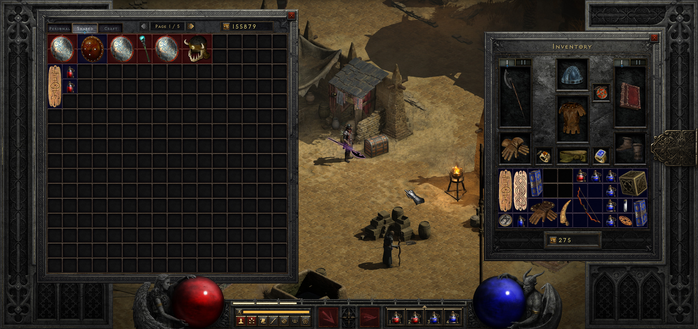
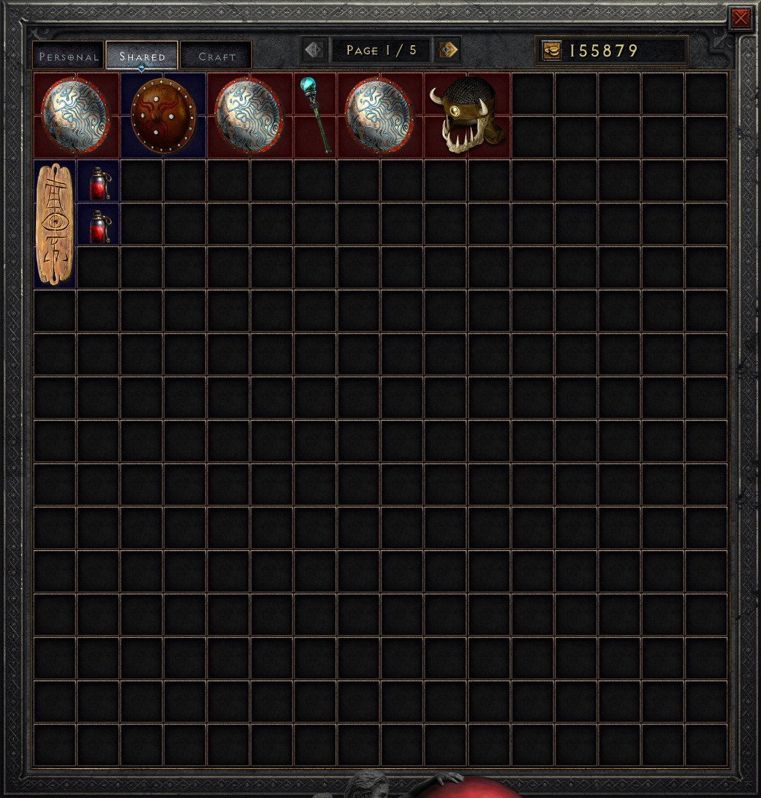
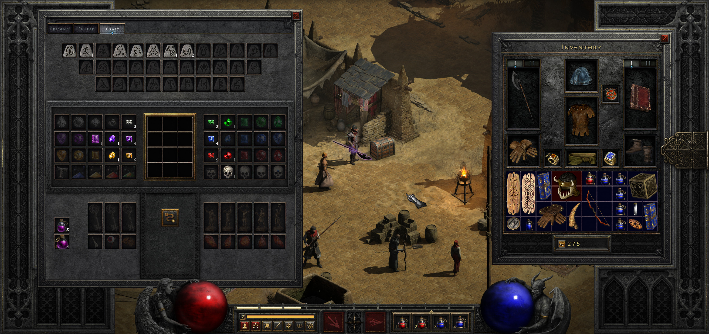
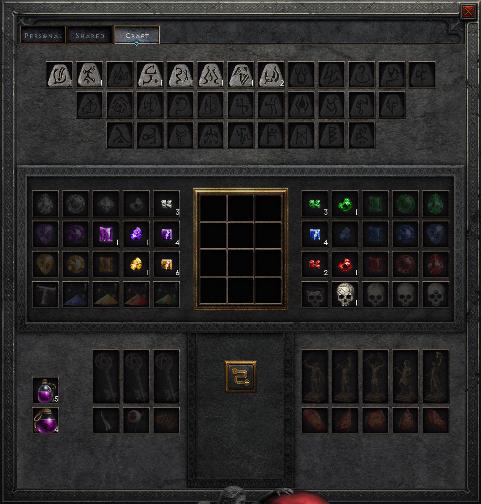

# Horadric Stash

This mod increases size of stash to 16x16 and replaces additional stash tabs with single "Craft" tab containing all runes, gems and materials.

Since v1.1.0 this mod should be R2DMM compatible but was not tested thoroughly.

**Warning: This mod requires "Reign of the Warlock" DLC**

## Screenshots

### Shared Stash

### Craft Stash

## Installation

1. Download or clone this repository
2. Move `HoradricStash` directory to `mods` directory in your Diablo II Resurrected instalation directory.
3. If necessary copy old saves to `mods/HoradricStash` directory in your save file location (usually `Users/{yourUsername}/Saved Games/Diablo II Resurrected`)
4. To run game with mod enabled open game settings in Battle.net launcher and set following additiona command line arguments: `-mod HoradricStash -txt`

## Known Issues

- Currently mod is not compatible with non-RotW character saves. Game will start but will crush when trying to open stash.